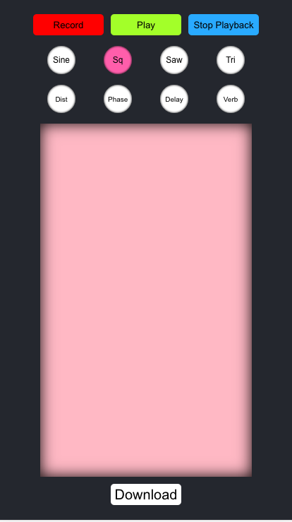

# Synth
Synth was designed to allow a user to create music on the go by simply choosing a sound and moving their finger across the screen. You can choose from 4 different wave patterns and effects to create cool tones, and simply record your finger movements on the play pad. Download your file afterwards to share with friends or use in your music project.

# Getting Started
* Clone this repo to your local machine
* Navigate to the client folder, and run npm install
* Start by using the npm start command
* Thats it!

# Tech Stack
* React
* Tone.js

